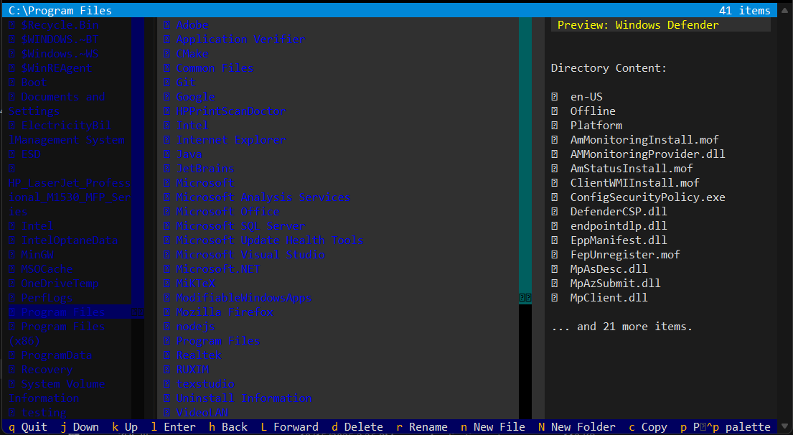

# 📂 File Ranger
 
**A high-performance terminal file manager built with C++ and Python.**
 
[](LICENSE)
[](https://www.python.org/)
[](https://isocpp.org/)
[](https://cmake.org/)
[]()
[]()
 
File Ranger is a terminal-based file manager developed as a **Data Structures & Algorithms semester project** at COMSATS University Lahore. It pairs a high-performance **C++ backend** with a modern **Python Textual** interface, demonstrating real-world application of custom data structures including an N-ary Tree, Merge Sort, and a Dual-Stack navigation system.
 

 
---
 
## 🎥 Demo Video
 
Watch the full project walkthrough:
 
**[▶ Click here to watch the demo](https://youtu.be/Wc0XyFCvwr4)**
 
---
 
## 📥 Download
 
Pre-built standalone executables are available in the [Releases](https://github.com/najmularifeen786/TUI_File_Manager/releases) section.
 
1. Go to [Releases](https://github.com/najmularifeen786/TUI_File_Manager/releases).
2. Download the latest `file_ranger.exe` (Windows) or `file_ranger` (Linux/macOS).
3. Run the executable — no installation required.
> Developers who want to build from source can follow the [Installation](#-installation) guide below.
 
---
 
## 📑 Table of Contents
 
- [Features](#-features)
- [System Requirements](#-system-requirements)
- [Installation](#-installation)
- [Usage](#-Usage)
- [Keyboard Shortcuts](#️-keyboard-shortcuts)
- [Architecture & Data Structures](#️-architecture--data-structures)
- [Project Structure](#-project-structure)
- [Performance](#-performance)
- [Troubleshooting](#️-troubleshooting)
- [Customization](#-customization)
- [Contributing](#-contributing)
- [Acknowledgments](#-acknowledgments)
- [License](#-license)
- [Authors](#-authors)
---
 
## ✨ Features
 
### File Operations
- Create, rename, delete, copy, and paste files and directories
- Recursive directory traversal with no depth limit
- Automatic duplicate name prevention with error handling
- Real-time binary file size display
### Navigation
- Browser-style back/forward history via a dual-stack architecture
- Three-pane layout: directory tree, file list, and live preview
- Vim-style keyboard shortcuts and full mouse support
### Interface
- Modern TUI built with Python Textual and Rich
- Multiple color themes, color-coded items, and file icons
- Command palette for quick access to actions
### Performance
- C++ backend with custom N-ary Tree for filesystem representation
- Manual Merge Sort — O(N log N) guaranteed, no STL sort dependency
- O(1) navigation operations via the dual-stack system
- Smart pointer memory management throughout the C++ codebase
- Zero-copy data transfer between C++ and Python via pybind11
---
 
## 🎯 System Requirements
 
| Requirement | Version |
|-------------|---------|
| Python | 3.8+ |
| CMake | 3.15+ |
| C++ Compiler | C++17-compatible |
 
**Compiler by platform:**
 
- **Windows** — Visual Studio Build Tools with "Desktop development with C++" workload
- **Linux** — GCC 7+ or Clang 5+ (`sudo apt-get install build-essential`)
- **macOS** — Xcode Command Line Tools (`xcode-select --install`)
Verify CMake is available before proceeding:
 
```bash
cmake --version
```
 
---
 
## 🚀 Installation
 
### 1. Clone the Repository
 
```bash
git clone https://github.com/najmularifeen786/TUI_File_Manager.git
cd TUI_File_Manager
```
 
### 2. Create a Virtual Environment
 
**Linux / macOS:**
```bash
python3 -m venv venv
source venv/bin/activate
```
 
**Windows:**
```powershell
python -m venv venv
.\venv\Scripts\activate
```
 
> If PowerShell blocks activation, run: `Set-ExecutionPolicy Unrestricted -Scope Process`
 
### 3. Install Dependencies
 
```bash
pip install -r requirements.txt
```
 
### 4. Build the Application
 
This single command compiles the C++ backend, creates the Python extension, and packages the project with PyInstaller:
 
```bash
python build_release.py
```
 
On success, the executable will be available at:
 
```
dist/
└── file_ranger.exe     # Windows
└── file_ranger         # Linux / macOS
```
 
---
 
## 🖥️ Usage
 
### Running the Executable
 
**Windows:**
```
dist\file_ranger.exe
```
 
**Linux / macOS:**
```bash
./dist/file_ranger
```
 
### Running from Source (Developers)
 
```bash
python ui/app.py
```
 
---
 
## ⌨️ Keyboard Shortcuts
 
| Key | Action |
|-----|--------|
| `j` / `↓` | Move down |
| `k` / `↑` | Move up |
| `h` / `←` | Go to parent directory / Go back |
| `l` / `→` / `Enter` | Enter directory / Open file |
| `L` | Go forward in history |
| `n` | Create new file |
| `N` | Create new folder |
| `r` | Rename file or directory |
| `d` | Delete file or directory |
| `c` | Copy file or directory |
| `p` | Paste copied item |
| `Ctrl+P` | Command palette |
| `q` | Quit |
| Mouse | Click to navigate and select |
 
---
 
## 🏗️ Architecture & Data Structures
 
### Backend (C++)
 
| Structure | Purpose |
|-----------|---------|
| N-ary Tree | Represents the filesystem hierarchy |
| Merge Sort | Sorts directory entries in O(N log N) |
| Dual-Stack ADT | Powers forward/backward navigation in O(1) |
| Recursive Algorithms | Directory traversal and file operations |
| Smart Pointers | Memory-safe ownership throughout the codebase |
 
### Frontend (Python)
 
Built with **Textual** and **Rich**. The UI is event-driven, supporting both keyboard and mouse input, with a live-updating three-pane layout and a pluggable theme system.
 
### Integration
 
**pybind11** provides type-safe C++ to Python bindings, with a **CMake** build system for cross-platform compilation. Data is transferred between layers with zero-copy semantics for optimal performance.
 
---
 
## 📁 Project Structure
 
```
TUI_File_Manager/
├── assets/
│   └── image.png                          # Project screenshots and media
├── backend/
│   ├── include/
│   │   ├── custom_stack.h                 # Custom stack ADT implementation
│   │   ├── file_node.h                    # File/directory node structure
│   │   └── history_manager.h              # Navigation history management
│   └── src/
│       └── directory_tree.cpp             # Directory tree and core logic
├── bindings/
│   ├── CMakeLists.txt                     # CMake configuration for pybind11
│   └── pybind_module.cpp                  # C++ to Python interface bindings
├── ui/
│   ├── app.py                             # Main application entry point
│   ├── backend.cpython-313-x86_64-li...   # Compiled C++ extension module
│   ├── icons.py                           # TUI icon definitions
│   ├── input_modal.py                     # User input modal components
│   └── layout.py                          # TUI layout and grid setup
├── .gitignore                             # Git ignore rules
├── LICENSE                                # Project license
├── README.md                              # Project documentation
├── build_release.py                       # Build and packaging script
└── requirements.txt                       # Python dependencies
```
 
---
 
## 📊 Performance
 
| Operation | Complexity |
|-----------|------------|
| Directory Traversal | O(N) |
| Sorting (Merge Sort) | O(N log N) |
| Navigation (back/forward) | O(1) |
| Copy / Delete | Recursive |
 
---
 
## 🛠️ Troubleshooting

### 1. Build & Compiler Issues

#### `cmake` is not recognized

- **Cause:** CMake is either not installed or not added to your system's environment variables.
- **Solution:** Install CMake from [cmake.org](https://cmake.org/) and ensure you check
  the option to add it to your system PATH. Verify the installation by running:

```bash
cmake --version
```

---

#### C++ compiler not found

- **Windows:** Install [Visual Studio Build Tools](https://visualstudio.microsoft.com/visual-cpp-build-tools/)
  and make sure to check the **"Desktop development with C++"** workload during installation.

- **Linux:** Install the standard build utilities:

```bash
sudo apt-get install build-essential
```

- **macOS:** Install the Xcode command-line tools:

```bash
xcode-select --install
```

---

#### Windows build failure

- **Solution:** Do not use the standard Command Prompt or PowerShell. Open the
  **Developer Command Prompt for Visual Studio** (or Developer PowerShell) and
  run the build script from there.

---

#### Linux build failure

- **Solution:** Ensure that the `libstdc++` development packages are installed on your system.

---

#### macOS build failure

- **Solution:** Try explicitly setting the deployment target in your terminal
  before running the build script:

```bash
export MACOSX_DEPLOYMENT_TARGET=10.15
python build_release.py
```

---

### 2. Runtime & Application Issues

#### `No module named 'backend'`

- **Cause:** The C++ extension module (`pybind11` binary) did not compile
  successfully or is missing from the `ui/` directory.
- **Solution:** Run the build script again and carefully review the terminal
  output for compiler errors:

```bash
python build_release.py
```

---

#### Navigation history not working

- **Cause:** Internal state issue with the navigation stack.
- **Note:** The underlying dual-stack system natively supports unlimited history
  tracking. If steps are skipped or history fails to register, please open a
  GitHub issue with the exact steps to reproduce the bug.

---

### 3. Display & UI Issues

#### Poor visual display or missing icons

- **Terminal:** Ensure you are using a modern terminal emulator that supports
  256-color or true-color output (e.g., Windows Terminal, iTerm2, or Alacritty).
- **Fonts:** This TUI relies heavily on glyphs. You must download and install a
  [Nerd Font](https://www.nerdfonts.com/) (such as FiraCode Nerd Font or
  JetBrainsMono Nerd Font) and set it as the default font in your terminal settings.
## 🎨 Customization
 
**Themes** — Edit or add themes in `ui/themes.py`. Themes can also be switched at runtime via the command palette (`Ctrl+P`).
 
**Keyboard Shortcuts** — All key bindings are defined in `ui/app.py` and can be remapped freely.
 
---
 
## 🤝 Contributing
 
Contributions are welcome.
 
1. Fork the repository.
2. Create a feature branch: `git checkout -b feature/your-feature`
3. Commit your changes: `git commit -m "Add your feature"`
4. Push the branch: `git push origin feature/your-feature`
5. Open a Pull Request.
**Guidelines:**
- Follow C++17 standards for backend code.
- Use type hints in Python code.
- Maintain O(N log N) or better complexity for new algorithms.
- Add tests for new features.
- Update documentation for any user-facing changes.
---
 
## 🙏 Acknowledgments
 
Built with the following technologies:
 
- **C++ (C++17)** — High-performance backend with custom data structures
- **Python** — Application logic and UI layer
- **Textual** — Modern terminal UI framework
- **Rich** — Terminal formatting and rendering
- **pybind11** — Seamless C++/Python integration
- **CMake** — Cross-platform build system
---
 
## 📄 License
 
This project is licensed under the [MIT License](LICENSE).
 
---
 
## 👥 Authors

### Najmul Arifeen
**Data Structures**
* najmularifeen786@gmail.com
* **[GitHub](https://github.com/najmularifeen786)**
* **[LinkedIn](https://www.linkedin.com/in/najmularifeen/)**

### Waqar Ahmad
**Frontend UI, Backend Architecture & Integration**
* codewithwaqarahmad@gmail.com
* **[GitHub](https://github.com/WaqarAhmad321)**
* **[LinkedIn](https://www.linkedin.com/in/waqar-ahmad321/)**
 
---
 
*Built as a Data Structures & Algorithms semester project at COMSATS University Lahore — demonstrating that data structures and algorithms are not just theory, but the foundation of efficient, real-world systems.*
